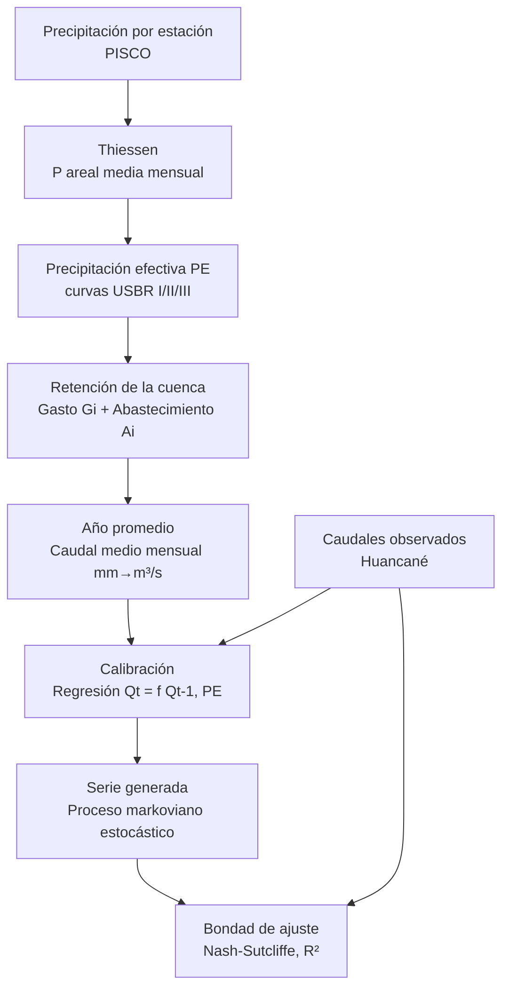

# LutzScholz2R — Documento de Arquitectura

> Estado: **diseño** (sin implementar). Alcance de la v1: replicar **exactamente** la
> cuenca **Huancané** del Excel `INFORMACION - 3.xlsx`, con las funciones parametrizadas
> para generalizar a otras cuencas en una fase posterior.

---

## 1. Objetivo

Convertir la plantilla Excel del modelo hidrológico **Lutz Scholz** (PLAN MERIS II,
sierra peruana) en:

1. Un **motor de cálculo** en R (funciones puras, testeables) dentro del paquete `R/`.
2. Un **aplicativo Shiny** interactivo (`inst/Lutz-app/`) para modelar cuencas.

La v1 debe reproducir, con tolerancia numérica, los resultados de Huancané:
caudal generado, coeficientes de regresión y estadísticos de bondad de ajuste.

---

## 2. Flujo de datos (cadena del modelo)



Correspondencia con las hojas del Excel:

| Etapa | Hoja Excel | Módulo R propuesto |
|-------|-----------|--------------------|
| P por estación | `PRECIPITACION` | `data_io.R` |
| P areal | `THIESSEN` | `data_io.R` |
| PE (USBR) | `CALIBRACION` / `SERIE GENERADA` | `precip_efectiva.R` |
| Retención | `CALIBRACION` | `retencion.R` |
| Año promedio | `CALIBRACION` | `ano_promedio.R` |
| Calibración | `CALIBRACION` | `calibracion.R` |
| Serie generada | `SERIE GENERADA` | `generacion.R` |
| Bondad de ajuste | `CALIBRACION` (regresión) | `bondad.R` |
| Serie temporal | `ANALISIS GRAFICO` | (salida para Shiny) |

---

## 3. Ecuaciones del modelo (extraídas de las fórmulas del Excel)

### 3.1 Precipitación efectiva (USBR)
Polinomio de 5º grado por curva, aplicado a la P areal (Thiessen):

```
PE_curva(P) = a0 + a1·P + a2·P² + a3·P³ + a4·P⁴ + a5·P⁵
PE          = C1·PE_II + C2·PE_III        con   C1 + C2 = 1
```
Huancané: `C1 = 0.844`, `C2 = 0.156` (modelo calibrado).

### 3.2 Retención — agotamiento y abastecimiento
Coeficiente de agotamiento y relación de caudales:

```
b0 = exp(−a·Δt)                    a = 0.009 /día, Δt = 30 → b0 ≈ 0.756
bi = b0^i         (meses de estiaje: descarga de la retención)
Gi = R · bi / Σbi                  gasto mensual de la retención
Ai = R · ai       (meses húmedos: abastecimiento de la retención)
```
Huancané: `R = 47 mm`, caudal base `= 2.54 m³/s`.

### 3.3 Caudal del año promedio
```
Caudal_mm(mes) = PE + Gi − Ai
Caudal_m³/s    = Caudal_mm · Área · 1000 / (días_mes · 86400)
```

### 3.4 Calibración (regresión múltiple)
```
Qt = b1 + b2·Qt-1 + b3·PEt
```
Huancané (calibrado): `b1 = −2.481`, `b2 = 0.613`, `b3 = 0.738`,
`S (error típico) = 5.41`, `R² ajustado = 0.916`, `R² = 0.931`, corr. múltiple = 0.965.

### 3.5 Generación estocástica (markoviano de 1er orden)
```
Qt = | b1 + b2·Qt-1 + b3·PEt + z·S·√(1 − R²) |
```
`z` = número aleatorio ~ Normal(0,1). Para el primer mes se usa el caudal base (2.54)
como `Qt-1`; luego la serie se encadena mes a mes y año a año.

---

## 4. Parámetros de la cuenca (Huancané — defaults v1)

| Parámetro | Símbolo | Valor | Fuente (celda) |
|-----------|---------|-------|----------------|
| Área de la cuenca | A | 3631.192 km² | CALIBRACION!E126 |
| Coef. de agotamiento | a | 0.009 /día | CALIBRACION!E127 |
| Constante K | K | 0.03 | CALIBRACION!H127 |
| Relación de caudales (30 d) | b0 | 0.756 | CALIBRACION!E128 |
| Gasto de retención | R | 47 mm | CALIBRACION!E129 |
| Caudal base | Q0 | 2.54 m³/s | SERIE GENERADA!R104 |
| Mezcla de curvas PE | C1/C2 | 0.844 / 0.156 | CALIBRACION!E107/F107 |
| Coef. regresión | b1,b2,b3 | −2.481, 0.613, 0.738 | CALIBRACION!C150:C152 |
| Error típico | S | 5.41 | CALIBRACION!C153 |
| Determinación | R² | 0.916 | CALIBRACION!C154 |

Se agrupan en una estructura `lutz_params` (lista/S3) para pasarse entre funciones.

---

## 5. Arquitectura del paquete (`R/`)

Funciones **puras** (sin efectos de Shiny), con firmas propuestas:

### `R/data_io.R`
```r
# Lee las hojas del Excel y devuelve una lista estructurada.
read_lutz_excel(path, sheets = c("CAUDAL HUANCANE","PRECIPITACION",
                                 "THIESSEN","CALIBRACION","SERIE GENERADA")) -> list

# Extrae la matriz año×mes de caudales observados (m³/s).
caudal_observado(x) -> data.frame  # cols: anio, ene..dic, total

# Extrae la P areal mensual de Thiessen.
precip_thiessen(x) -> data.frame   # cols: anio, ene..dic, total
```

### `R/precip_efectiva.R`
```r
# Aplica un polinomio de 5º grado a un vector de precipitación.
pe_curva(P, coef) -> numeric        # coef = c(a0,a1,a2,a3,a4,a5)

# Precipitación efectiva mezclando dos curvas USBR.
pe_usbr(P, coef_II, coef_III, c1, c2 = 1 - c1) -> numeric
```

### `R/retencion.R`
```r
# Coeficientes de descarga bi de los meses de estiaje.
coef_agotamiento(b0, meses_estiaje) -> numeric

# Gasto Gi y abastecimiento Ai de la retención.
retencion(pe, R, b0, meses_estiaje, meses_humedos, coef_abast) -> data.frame
# devuelve: mes, bi, Gi, ai, Ai
```

### `R/ano_promedio.R`
```r
# Balance del año promedio: caudal mensual determinístico.
ano_promedio(pe, retencion, params) -> data.frame
# cols: mes, dias, P, PE, Gi, Ai, caudal_mm, caudal_m3s
```

### `R/calibracion.R`
```r
# Ajusta Qt = b1 + b2·Qt-1 + b3·PEt por regresión múltiple.
calibrar_regresion(q_obs, pe) -> lutz_calibracion
# devuelve: coeficientes b1,b2,b3; S; R²; R²_aj; ANOVA; corr múltiple
```

### `R/generacion.R`
```r
# Genera la serie sintética extendida (markoviano de 1er orden).
generar_serie(pe_matriz, calib, q0, seed = NULL) -> data.frame
# cols: anio, ene..dic  (caudales m³/s)  — reproducible vía seed
```

### `R/bondad.R`
```r
nash_sutcliffe(obs, sim) -> numeric
r2(obs, sim)            -> numeric
rmse(obs, sim)          -> numeric
# tabla resumen de bondad de ajuste
bondad_ajuste(obs, sim) -> data.frame
```

### `R/params.R`
```r
# Constructor + defaults de Huancané.
lutz_params(area = 3631.192, a = 0.009, b0 = 0.756, R = 47,
            q0 = 2.54, c1 = 0.844, ...) -> lutz_params
huancane_params() -> lutz_params
```

---

## 6. Mapeo a los módulos Shiny

La UI actual (`inst/Lutz-app/app.R`) ya tiene 5 pestañas; se convierten en
**módulos Shiny** (`mod_*_ui` / `mod_*_server`) que consumen el motor:

| Pestaña actual | Módulo | Funciones del motor que usa |
|----------------|--------|-----------------------------|
| Carga y Exploración | `mod_datos` | `read_lutz_excel`, `precip_thiessen`, `caudal_observado` |
| Parámetros de Cuenca | `mod_params` | `lutz_params`, `huancane_params` |
| Balance Hídrico | `mod_ano_promedio` | `pe_usbr`, `retencion`, `ano_promedio` |
| Serie Extendida | `mod_generacion` | `calibrar_regresion`, `generar_serie` |
| Modelos ART | `mod_art` | (extensión futura, fuera de v1) |

Reactividad: los inputs de "Parámetros de Cuenca" alimentan un `lutz_params`
reactivo; cambiarlos recalcula año promedio y serie en vivo. Gráficos con `plotly`
(hidrograma observado vs generado, réplica de `ANALISIS GRAFICO`).

---

## 7. Estrategia de validación (v1 = fidelidad al Excel)

Tests en `tests/testthat/` que comparan contra valores exactos del Excel
(tolerancia ~1e-2 por el redondeo de la plantilla):

| Comprobación | Valor objetivo (Excel) |
|--------------|------------------------|
| Caudal generado Ene (calibrado) | 42.684 m³/s |
| Caudal generado Feb | 51.177 m³/s |
| Total anual caudal generado | 17.537 (mm base) |
| Coef. regresión b2 / b3 | 0.613 / 0.738 |
| R² ajustado | 0.916 |
| Serie generada 1981 Ene | 94.09 m³/s (con misma semilla/aleatorios) |

> Nota: la serie estocástica depende de los números aleatorios. Para validar,
> la fase 1 usará **los aleatorios del propio Excel** (hoja `SERIE GENERADA`,
> bloque "NUMEROS ALEATORIOS") como entrada fija; la aleatoriedad propia se
> activa después con `seed`.

---

## 8. Roadmap por fases

- **Fase 1 — Motor + validación (Huancané fijo).** `R/*.R` + `tests/testthat/`.
  Reproducir los números del Excel. *(Alcance de esta v1.)*
- **Fase 2 — Conectar Shiny.** Rellenar el `server`, modularizar la UI, gráficos plotly.
- **Fase 3 — Interactividad.** Sliders de parámetros en vivo, exportar resultados,
  ajuste de curvas PE.
- **Fase 4 — Generalización.** Carga de cuencas arbitrarias (Excel/CSV del usuario),
  polígonos de Thiessen dinámicos, múltiples cuencas, módulo ART.

---

## 9. Dependencias previstas

`shiny`, `bslib` (ya en uso), `readxl` (lectura Excel), `plotly` (gráficos),
`dplyr`/`tidyr` (manejo de datos), `testthat` (validación). Todas en CRAN.

---

## 10. Estado de implementación (Fase 1 — motor validado)

El motor está implementado en `R/` y **validado celda a celda** contra la plantilla
de Huancané (12 tests `testthat` en verde):

| Componente | Archivo | Error máx. vs Excel |
|------------|---------|---------------------|
| Precipitación efectiva USBR | `precip_efectiva.R` | 5e-5 mm |
| Retención (gasto/abastecimiento) | `retencion.R` | — |
| Año promedio (caudal m³/s) | `ano_promedio.R` | 5e-5 |
| Calibración (b1,b2,b3,S,R²) | `calibracion.R` | exacto |
| Serie generada (markoviano) | `generacion.R` | 4e-3 m³/s |
| Bondad de ajuste | `bondad.R` | — |

Datos de referencia empaquetados: `precip_media_huancane`, `caudal_huancane`,
`aleatorios_huancane` (en `data/`).

### ⚠️ Hallazgo a decidir — inconsistencia de la plantilla original
La **calibración** usa la PE **mezclada** (`c1·PE_II + c2·PE_III`), pero la
**generación** de la serie alimenta la regresión con **PE_II sola** (curva II). Se
replicó fielmente (`generar_serie` usa `curva = "II"` por defecto), pero conviene
decidir si se homogeneíza a la PE mezclada en una versión "corregida" del modelo.

## 11. Decisiones abiertas para revisar

1. ¿Meses de estiaje/húmedos fijos (Abr–Sep / Oct–Mar) o detectados por régimen?
2. ¿La generación usa PE_II (fiel al Excel) o PE mezclada (coherente con la calibración)?
3. ¿Reproducir los números aleatorios del Excel o migrar a `rnorm()` con semilla?
4. ¿El módulo ART entra en el roadmap o se descarta por ahora?
5. Formato de exportación de resultados (CSV, Excel, informe HTML/PDF).
