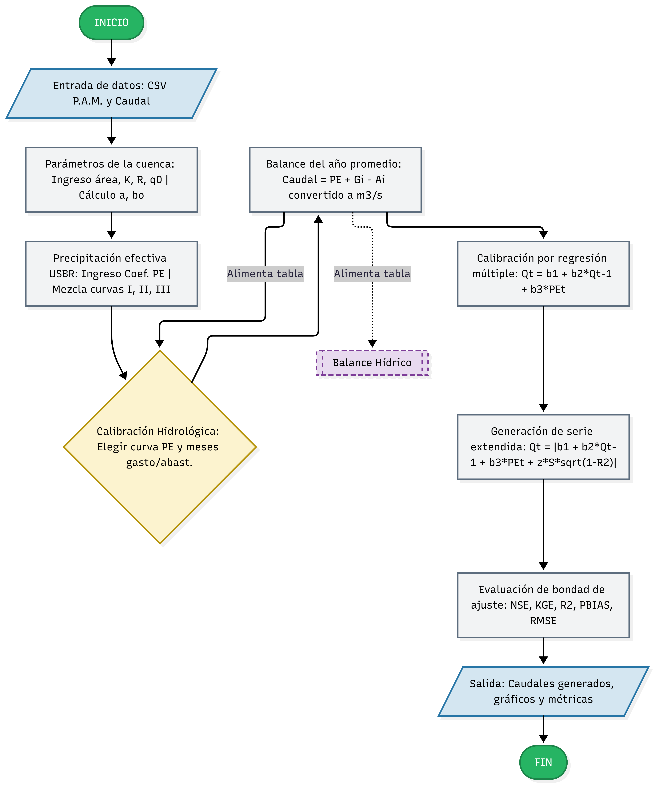

# LutzScholz2R

## Modelo hidrológico Lutz Scholz

En el estudio *Generación de caudales mensuales en la sierra peruana* (1980),
del Programa Nacional de Pequeñas y Medianas Irrigaciones - PLAN MERIS II, se
plantea este modelo hidrológico determinístico-estocástico para generar
**caudales medios mensuales** en cuencas de la sierra peruana a partir de la
**precipitación**. Combina un balance determinístico del año promedio con una
extensión estocástica mediante un proceso markoviano de primer orden.

`LutzScholz2R` implementa el modelo en R —un motor de cálculo puro, validado
celda a celda contra la plantilla Excel original de la cuenca Huancané— y lo
expone en un aplicativo Shiny interactivo.

## Flujo del modelo



De la precipitación y el caudal observado que carga el usuario hasta la serie
de caudales generada y su evaluación: qué se ingresa, qué calcula el motor, y
dónde decide el usuario (curva de precipitación efectiva, meses de gasto y
abastecimiento de la retención).

## Estado del proyecto

- **Motor de cálculo:** implementado en `R/`, validado contra la plantilla
  Excel de la cuenca Huancané (22 tests `testthat` en verde). Cubre
  precipitación efectiva USBR (curvas I, II, III y sus mezclas), retención de
  la cuenca, balance del año promedio, calibración por regresión múltiple,
  generación estocástica (proceso markoviano) y métricas de bondad de ajuste
  (NSE, KGE, R², RMSE, PBIAS).
- **Aplicativo Shiny:** `inst/Lutz-app/app.R`, con 5 pestañas:
  1. **Carga y Exploración** — el usuario sube sus propios CSV de
     precipitación y caudal observado (sin datos precargados por defecto).
  2. **Parámetros de Cuenca** — área, retención y caudal base se ingresan; el
     coeficiente de agotamiento y la relación de caudales a 30 días se
     calculan automáticamente; incluye la tabla de precipitación efectiva
     replicada del Excel (curvas I-II y II-III).
  3. **Calibración Hidrológica** — el usuario elige la curva de PE para
     calibrar y los meses de gasto (época seca) y de abastecimiento (época
     húmeda, con el coeficiente `ai` sujeto a que su suma sea 1), y obtiene
     el año promedio calibrado comparado contra el caudal observado (NSE,
     KGE, R², PBIAS).
  4. **Balance Hídrico** — el mismo balance del año promedio calibrado en la
     pestaña anterior, en una vista alterna (tabla + gráfico de P, PE y
     caudal).
  5. **Serie Extendida** — genera la serie sintética de caudales, calibrada
     sobre el año promedio de la pestaña 3, y evalúa la bondad de ajuste
     frente al caudal observado.

Ver `DESIGN.md` para la arquitectura completa y las decisiones abiertas.

## Cómo ejecutar

```r
# Instalar dependencias (una vez)
install.packages(c("shiny", "bslib", "plotly", "DT", "readxl", "testthat"))

# Ejecutar la app (desde la raíz del repositorio)
shiny::runApp("inst/Lutz-app")
```

Formato de los CSV de entrada: una columna `anio` seguida de 12 columnas
mensuales (enero a diciembre).
